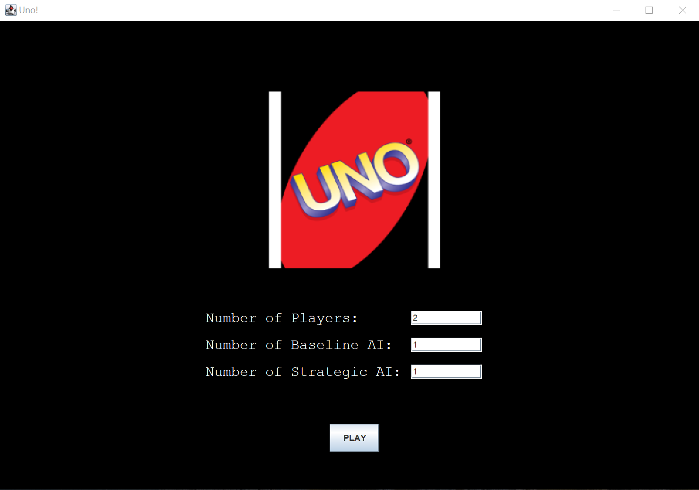
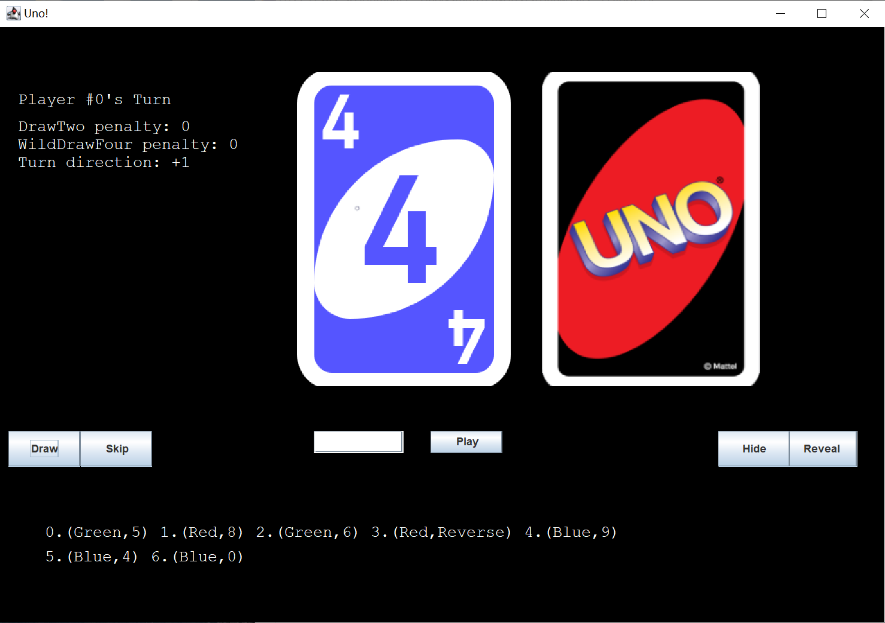
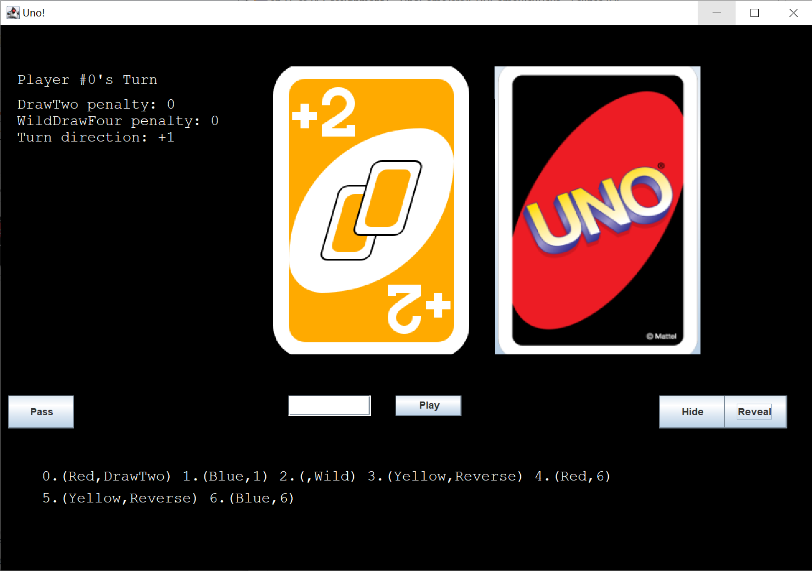
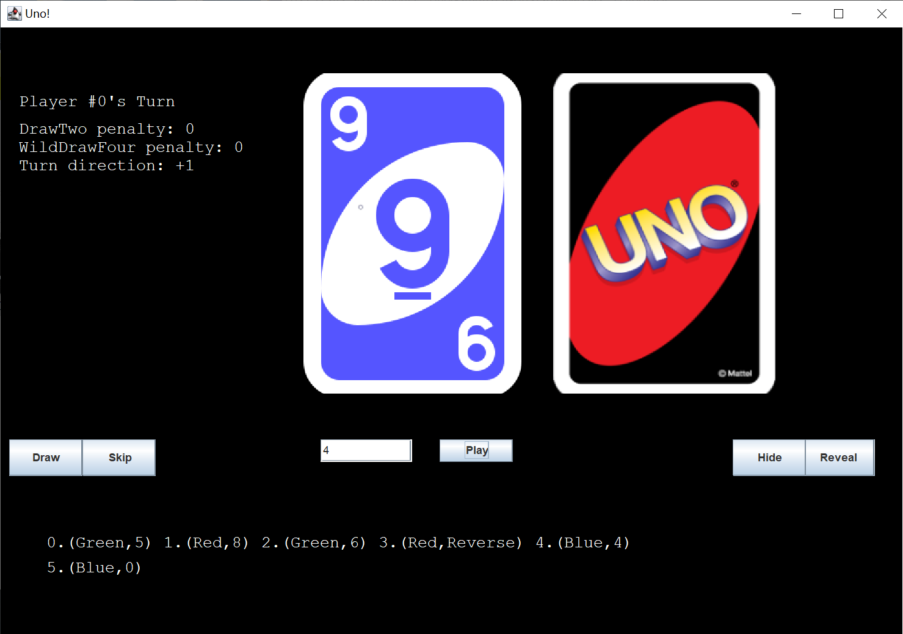
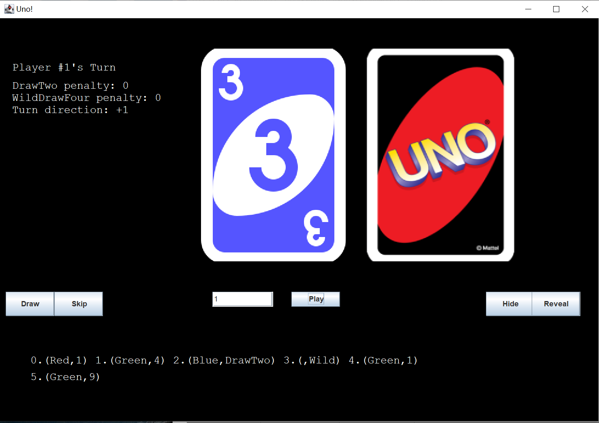
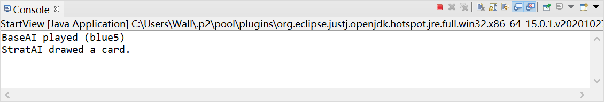
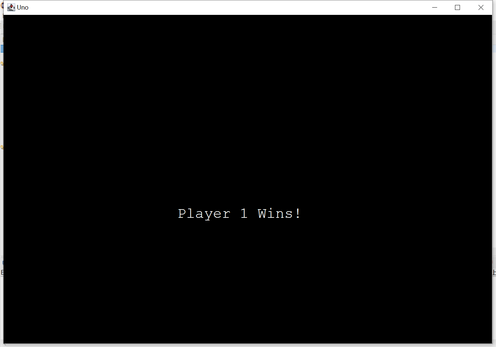

# Uno!

Uno Game
=====

An implementation for the game Uno. The game can be played by human and AI players.


Table of Contents
-----------------

* [Requirements](#requirements)
* [Purpose](#purpose)
* [Usage](#usage)
* [Screenshots](#screenshots)


Requirements
----

Uno requires the following to run:

* Java
* IDE to run Java applications (Eclipse, IntelliJ, etc.)

Purpose
----

The purpose of this project is to provide a working implementation of the game Uno.

Project Structure
-----
There are four main classes:
* Card
* Player
* GameBoard

The Card class is an abstract class with the subclasses:
* ColoredCard 
* WildCard

UnitTests have been created for each class.

Code Style
-----

The project uses Standard Java styling practices with Java doc comments, etc.

Usage
-----

###Method from GameBoard class that initialize players
```js
	/**
	 * Initialize players.
	 */
	private void initializePlayers() {
		players = new ArrayList<Player>();
		for (int p_idx = 0; p_idx < NUM_OF_PLAYERS; p_idx++) {
			players.add(new Player(p_idx, this));
		}	
	}
```

###Method from GameBoard class that deals cards to a specific players
```js
	/**
	 * Deal #n card to the given #player.
	 * 
	 * Randomly pick up a card, assign it to the player, 
	 *  and add it to the playersCards map as a record on the server side,
	 *  repeat n times.
	 * 
	 * @param player
	 */
	public void dealCardsTo(Player player, int n) {
		for (int i = 0; i < n; i++) {
			final Card card = pickACardFromDrawPile();
			player.receiveACard(card);
			playersCards.get(player).add(card);
		}
	}

```
###Method from Card class that overrides the toString function
```js
	@Override
	public String toString() {
		return "[" + type + "#" + getColor() + "]";
	}
```


Screenshots
-----

* Start View:
  
  This shows the starting view of the game.
  It displays the Uno logo with an input field for the number of human players, 
  baseline AI, and strategic AI.
  There is a PLAY button to start the game and bring the user to the game view. 

* Game View Initial:
  
  This shows the game view for the player with control buttons.
  It displays the game state information, the top card on the discard pile and the draw pile.
  There are draw, skip, play, hide, and reveal buttons to control the game.
  The input filed next to "Play" button is for entering the index of the card to play.
 
* Game View Hide:
  
  The current player's cards are hiden after clicking "Hide" button.  

* Game View Reveal:
  
  The current player's cards are displayed after clicking "Reveal" button. 

* Game View Player 0's Play:
  
  After player 0 played the matched card, the top card is updated immediately.

* Game View Player 1's Turn:
  
  After player 0 hits "Skip" button, the game passes to the next player.
  By default, the current player's cards are hiden.

* Game View Player 1's Play:
  
  After clicking "Reveal" button, player 1 is able to see his/her hands.
  After player 1 played the matched card, the top card is updated immediately.

* Game View AI's Play:
  
  Because the AIs play automatically in a very short time, the UI is not able to update.
  The console suggests the moves made by the AIs.

* End View:
  
  This is the view when a player has won and the game is over.
