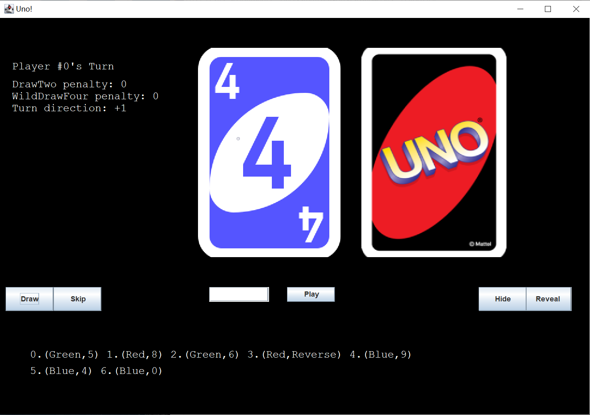
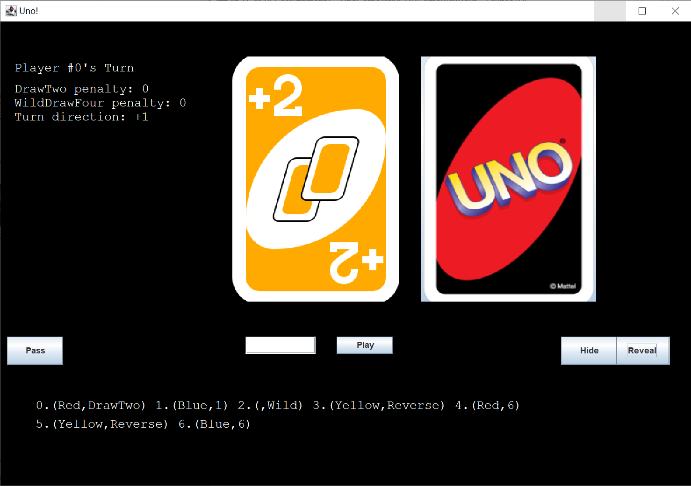
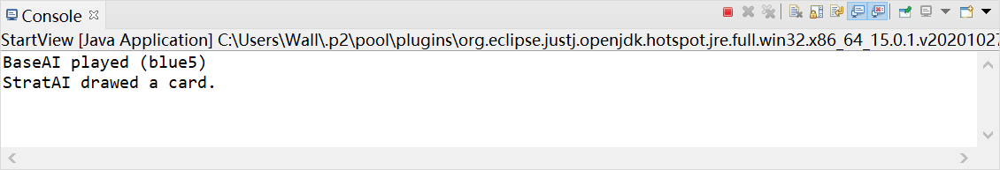
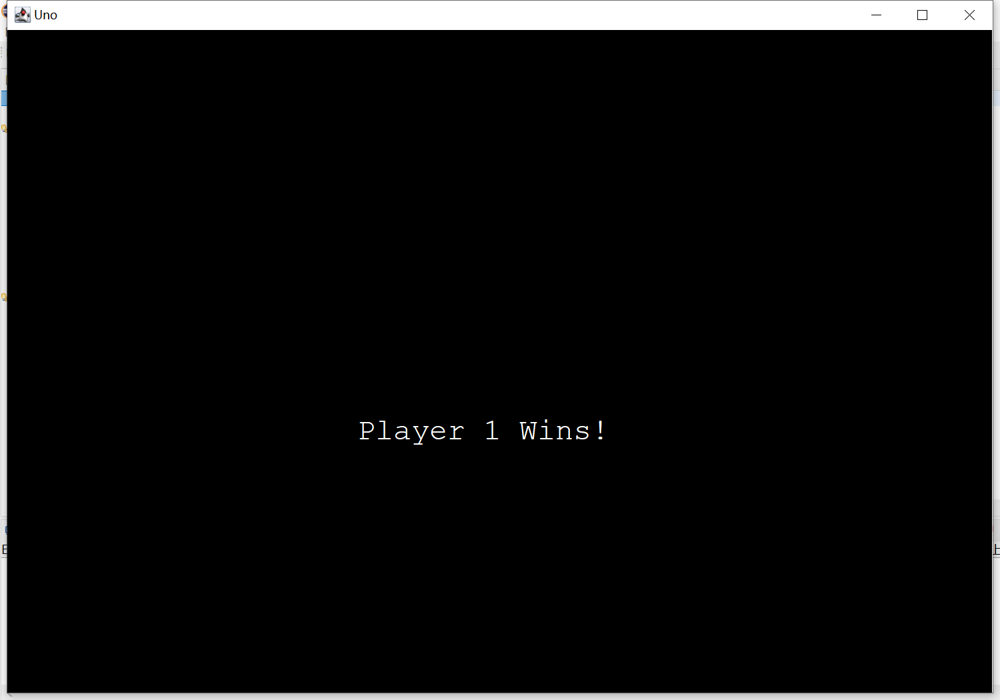

Uno Game GUI Test Plan
=====

Table of Contents
-----------------

* [Prerequisites](#prerequisites)
* [Purpose](#purpose)
* [Usage](#usage)

Prerequisites
----
*  Eclipse

Setup and Configurations
----
* Git clone this repository into a local directory
* To test the start view, the game view, and the end view, run the main functions in each of the classes.

Operations
----
* Start View:
  
  This shows the starting view of the game.
  It displays the Uno logo with an input field for the number of human players, 
  baseline AI, and strategic AI.
  There is a PLAY button to start the game and bring the user to the game view. 

* Game View Initial:
  
  This shows the game view for the player with control buttons.
  It displays the game state information, the top card on the discard pile and the draw pile.
  There are draw, skip, play, hide, and reveal buttons to control the game.
  The input filed next to "Play" button is for entering the index of the card to play.
 
* Game View Hide:
  
  The current player's cards are hiden after clicking "Hide" button.  

* Game View Reveal:
  
  The current player's cards are displayed after clicking "Reveal" button. 

* Game View Player 0's Play:
  
  After player 0 played the matched card, the top card is updated immediately.

* Game View Player 1's Turn:
  
  After player 0 hits "Skip" button, the game passes to the next player.
  By default, the current player's cards are hiden.

* Game View Player 1's Play:
  
  After clicking "Reveal" button, player 1 is able to see his/her hands.
  After player 1 played the matched card, the top card is updated immediately.

* Game View AI's Play:
  
  Because the AIs play automatically in a very short time, the UI is not able to update.
  The console suggests the moves made by the AIs.

* End View:
  
  This is the view when a player has won and the game is over.
  
